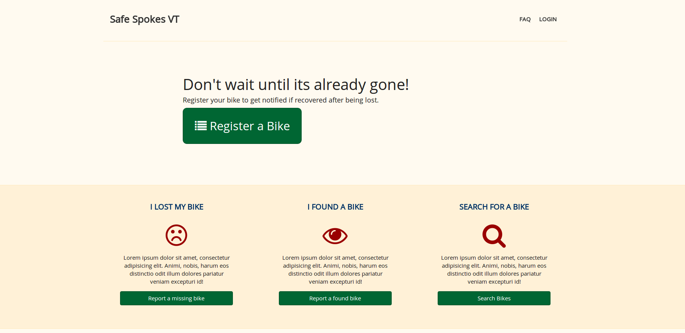

# Safes Spokes VT

Safe Spokes VT is a proof of concept bike registration tool built by Team
Wintermute during the [Hack VT 2013](http://hackvt.com) hackathon. 

This app was built by:

* [Sam Stelfox](https://github.com/sstelfox)
* [Jared Fullerton](https://github.com/jfullerton)
* [Gabe Koss](https://github.com/granolocks)
* [Zach Lincoln](https://github.com/zlincolnBHG)

## Caveat

This app was build in about 24 hours and is NOT production ready.

The punch list of Long term tasks in order to make it production ready:

* Better adminstration of Police and Bike Shop users
* Build out backend email notification behavior
* Handle Geolocation more appropriately
* Add an activity stream of Found / Stolen Bike activity
* Add a production ready DB such as Postgres

## Open Data 

* [List of Bike Shops in VT](http://www.vtbikeped.org/resources/biking-in-vermont/bike-shops.html)
* [Craigslist Bikes for Sale](http://burlington.craigslist.org/bia/)
* [Google Maps API](https://developers.google.com/maps/)
* [Wikipedia Bike SVG](http://en.wikipedia.org/wiki/File:Bicycle.svg)
* [List of Law Enforcement Agencies](http://en.wikipedia.org/wiki/List_of_law_enforcement_agencies_in_Vermont)

## Other References

* [Seven Days Article on Need for VT bike registry](http://www.7dvt.com/2013steal-wheels-would-police-registry-reduce-bike-thefts-burlington)
* [Burlington Police Report](http://www.police.ci.burlington.vt.us/LeadinHtml_VtBurlingtonPd/start-report.html)
* [Prior Art: Localmotion Bike Registry (defunct)](http://www.localmotion.org/bikeregistry)
* [Prior Art: Stolen Bike Registry (defunct)](http://stolenbicycleregistry.com/)
* [Research Document on This Sort of App](https://docs.google.com/document/d/1ZBJnq1XuDJ7JaYZj6Kfgsh0evfdNiNxusqmbkOGpIsw/edit?hl=en&authkey=CKnBgNkG)

